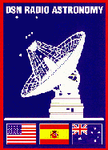
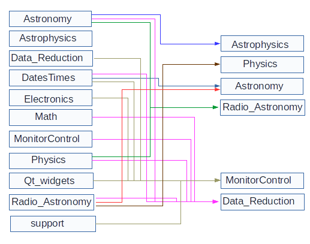

.. Radio Astronomy Software Tools documentation master file, created by
   sphinx-quickstart on Wed Oct 30 14:49:29 2019.
   You can adapt this file completely to your liking, but it should at least
   contain the root `toctree` directive.
   

Single Dish
===========
Radio Astronomy Software Tools
==============================

NOTICE: **These web pages are in the process of being built**, while simultaneously
converting from Python 2 to Python 3.  It will take a while.  Meanwhile, the
pages are open to public access as a sign of things to come. 2020-04-27.

Radio Astronomy Software Tools is a collection of software
packages that have proven useful in doing radio astronomy with NASA's
Deep Space Network.  It includes a monitor and control system that is
overlaid on the operational monitor and control to provide features
necessary or useful for conducting radio astronomy research. The collection
may provide a quick way to start a small single dish radio astronomy
*ab initio* because it is able to manage a telescope system in which all
subsystems have their own, network-accessible controllers.

In astronomy there is the need to transform coordinates into various 
coordinate systems and to compensate frequencies for the various motions of 
the observer, the Earth, and theb Sun, to compute frequencies such as 
recombination lines, to
calibrate signals in terms of temperature and flux density, to allow for
time dispersion of signals by free electrons, *etc.*, which led to 
additional packages
for astrophysics, physics, and radio astronomy engineering. 

.. toctree::
   :maxdepth: 1
   :caption: Contents:

   aboutastronomy
   aboutastrophysics
   aboutdatestimes
   aboutmath
   aboutradioastronomy
   
Interdependencies
=================

Indices and tables
==================

* :ref:`genindex`
* :ref:`modindex`
* :ref:`search`

Revised by Tom Kuiper, 2020 April 27

